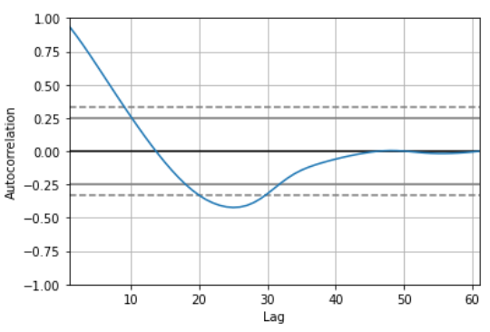

# Population Prediction (Time Series)

Prediction of any countrie's population using 1960-2020 years modified data from [The World Bank data](https://data.worldbank.org/indicator/SP.POP.TOTL)

### Run program
```bash
python prediction.py
```

### Choose country (period is fixed 10)

```bash
Enter country: 
```

## Importing data
```python
wp = pd.read_excel('World population database.xls')
wp = wp.set_index(['Country Name'])
wp = wp.drop(['Indicator Code', 'Country Code', 'Indicator Name'],axis=1)
print(wp.shape)
wp.head()
```
(266, 61)


### World population plot
```python
fig, ax = plt.subplots(1, 1, figsize=(16,5), dpi= 80)
plt.xlabel('Year', fontsize=15)
plt.ylabel('Population in Billions', fontsize=15)
ax.fill_between(total_population.columns[::5],list(total_population.values[0])[::5], 
                color='r',alpha=0.5, linewidth=3)
ax.set_title('Total world population in years', fontsize=18)
```


### Extracting useless rows
```python
countries = wp.drop(['Africa Eastern and Southern', 'Africa Western and Central', 'Arab World'...])
```

```python
print(countries.shape)
```
(218, 61)

```python
correction = {'Congo, Dem. Rep.': 'Dem. Rep. Congo',
        'Congo, Dem.':'Dem. Congo',...}
countries = countries.rename(index=correction)
```
### Looking for Nan values
```python
countries[countries.isna().any(axis=1)]
```


### Filling Nans
```python
countries.loc['Eritrea'] = countries.loc['Eritrea'].fillna(countries.loc['Eritrea','1969'])
countries.loc['West Bank and Gaza'] = countries.loc['West Bank and Gaza'].fillna(countries.loc['West Bank and Gaza','1990'])
kuwait_avg = (countries.loc['Kuwait','1991'] + countries.loc['Kuwait','1995'])/2
countries.loc['Kuwait'] = countries.loc['Kuwait'].fillna(kuwait_avg)
```

### Transpose dataframe to have years as indexes

```python
countries_transpose = countries.T
countries_transpose
```


### Converting indexes into datetimes
```python
countries_transpose.index = pd.to_datetime(countries_transpose.index).year
```

```python
countries_transpose['Armenia'].plot()
```


### Autocorrelation graph
```python
from pandas.plotting import autocorrelation_plot
autocorrelation_plot(countries_transpose['Armenia'])
```



### First order Differencing

```python
Armenia_diff = countries_transpose['Armenia'].diff(periods=1)[1:]
```


### Building Model

```python
import pmdarima as pm

model = pm.auto_arima(countries_transpose['Armenia'], start_p=1, start_q=1,test='adf',
                    max_p=4, max_q=4, m=1,
                    seasonal=False,   
                    start_P=0, 
                    D=0, 
                    trace=True,
                    error_action='ignore',  
                    suppress_warnings=True)      
             
print(model.summary())
```


### Predicting and putting values in Series
```python
n_periods = 10
forecast, confint = model.predict(n_periods=n_periods, return_conf_int=True)
forecast_id = pd.date_range(start='2021/01/01', periods=n_periods,freq='YS').year
forecast_series = pd.Series(forecast.round(decimals=0), index=forecast_id)
lower_series = pd.Series(confint[:, 0].round(decimals=0), index=forecast_id)
upper_series = pd.Series(confint[:, 1].round(decimals=0), index=forecast_id)
```
### Plotting forecast
```python
plt.figure(figsize=(10,8))
plt.plot(countries_transpose['Armenia'])
plt.plot(forecast_series)
plt.fill_between(lower_series.index, 
                 lower_series, 
                 upper_series, 
                 color='k', alpha=.15)

plt.title("Final Forecast")
plt.show()
```


### Forecasted values

```python
preds = pd.concat({'forecast':forecast_series,'lower border': lower_series, 'upper border': upper_series}, axis=1)
preds.astype('int')
```


# Some comperisons with [PopulationPyramid.net](https://www.populationpyramid.net/)

## My prediction of Armenia


## PopulationPyramid.net prediction


## My prediction of Kuwait


## PopulationPyramid.net prediction


